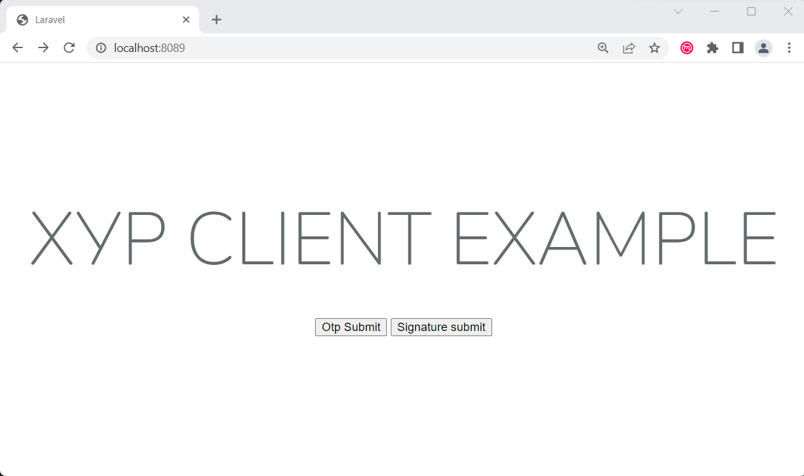

# xyp-client-code-php
Төрийн мэдээлэл солилцооны ХУР системийн хэрэглэгчийн жишээ кодыг PHP хэл дээр бэлтгэв.

## Шаардлага
    laravel version 11.0.8
    composer version 3.8.8
    php version ^7.2.5|^8.0
    docker суулгах

[.env](./.env) кодын шаардлагатай мэдээллийг бөглөх. Үүнд:
```bash
#ҮДТ - өөс олгогдсон accessToken мэдээлэл
XYP_TOKEN = "asdfhlkasdhfksjdfhlakhfdaskhdfkah"
#ҮДТ өөс олгогдсон openVPN key-ийн мэдээллийг агуулж буй файлын зам.
XYP_KEY = "/xypKey/key.key"
#Иргэний регистрийн дугаар
REGNUM = "АА00112233"
#Тоон гарын үсэг зурах client программын  local дээр ажиллаж буй хаяг. 
#ESIGN CLIENT программын хувьд тогтмол "127.0.0.1:97001" байна.
SIGNATURE_HOST = "127.0.0.1:97001"
```
[key.key](./xypKey/key.key) файлд ҮДТ-өөс олгогдсон openVPN key-ийн мэдээллийг хуулна.

## Ажиллуулах
```bash
docker build --t demo .
docker compose up -d 
docker exec -it laravel-demo-app-1 bash
composer install
php artisan key:generate
php artisan config:cache
php artisan route:cache
```
Дээрх командуудыг ажиллуулснаар үндсэн дэлгэц гарч ирнэ.

Үүнд:

Иргэнийг OTP кодоор баталгаажуулан дуудахдаа Otp Submit товчийг дарж үргэлжлүүлнэ.

Иргэнийг тоон гарын үсгээр баталгаажуулан дуудахдаа Signature submit товчийг дарж үргэлжлүүлнэ.


## Нэмэлт
ХУР сервис дуудаж байгаа кодууд [HomeController.php](./app/Http/Controllers/HomeController.php), [web.php](./routes/web.php),
дэлгэц зурж байгаа код [index.blade.php](./resources/views/index.blade.php) юм.

